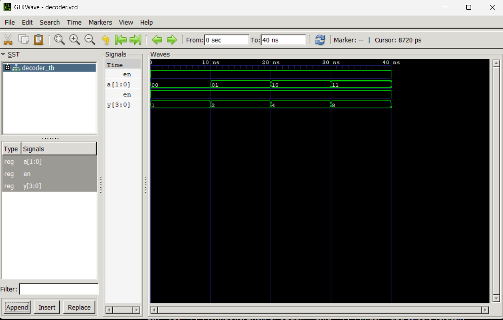
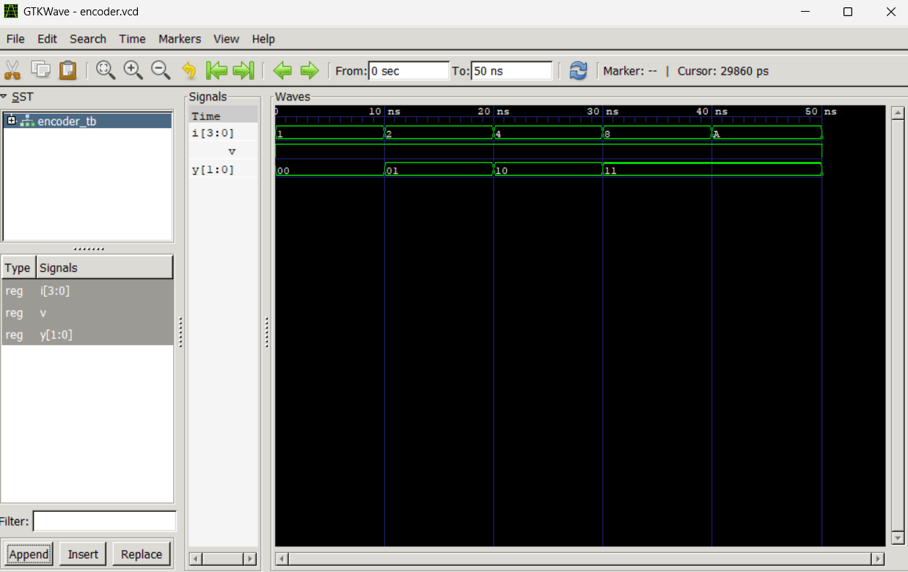

# Lab 3: VHDL Code for Combinational Circuits (Encoder and Decoder)

## Objective

- To design and simulate a 4-to-2 priority encoder in VHDL.
- To design and simulate a 2-to-4 decoder in VHDL.

---

## Theory

### Encoder

An encoder converts 2n input lines into an n-bit binary code. Only one input is active (HIGH)
at a time. A 4-to-2 encoder has 4 inputs (I0–I3) and produces a 2-bit output (Y1Y0).
A priority encoder handles the case where multiple inputs are high simultaneously by
giving priority to the highest-numbered active input.

#### Truth Table: 4-to-2 Priority Encoder

### |I3 | I2 | I1 | I0 | Y1 | Y0|
### |---|--- |--- |--- |--- |---|
### |0  | 0  | 0  | 1  | 0  | 0 |
### |0  | 0  | 1  | X  | 0  | 1 |
### |0  | 1  | X  | X  | 1  | 0 |
### |1  | X  | X  | X  | 1  | 1 |

### Decoder

A **decoder** converts an n-bit binary input into one of 2ⁿ output lines. Exactly one output is HIGH at a time. A **2-to-4 decoder** has a 2-bit input (A₁A₀) and 4 output lines (Y₀–Y₃).

#### Truth Table: 2-to-4 Decoder

### | A₁ | A₀ | Y₃ | Y₂ | Y₁ | Y₀ |
### |----|----|----|----|----|----| 
### | 0  | 0  | 0  | 0  | 0  | 1  |
### | 0  | 1  | 0  | 0  | 1  | 0  |
### | 1  | 0  | 0  | 1  | 0  | 0  |
### | 1  | 1  | 1  | 0  | 0  | 0  |

## Output

### Decoder

### Encoder

## Discussion and conclusion

From this lab, we learned that a priority encoder can manage multiple active inputs at the same time by selecting the highest-priority (highest-numbered) input, while a decoder changes an n-bit binary input into one of (2^n) output lines.

