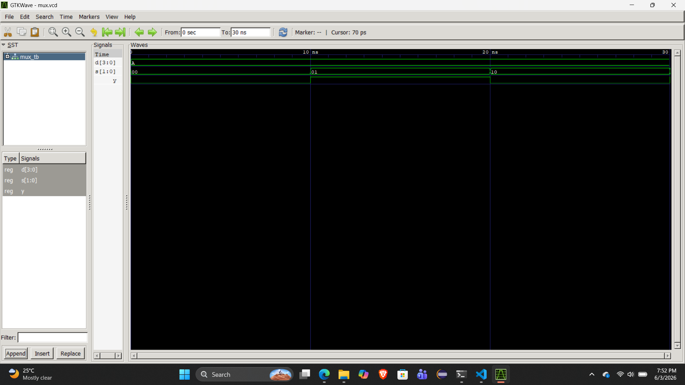
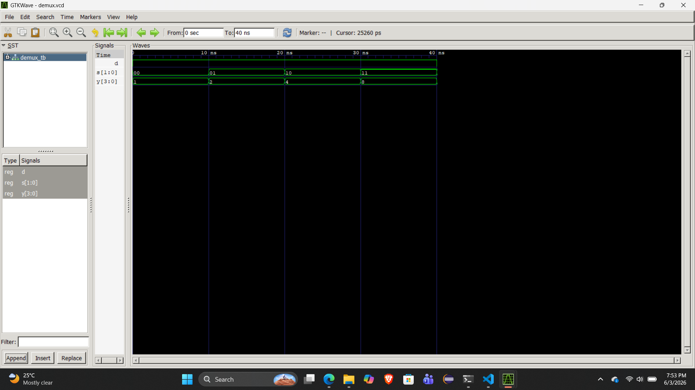

# Lab 4: VHDL Code for Combinational Circuits (MUX and DEMUX)

## Objective
• To design and simulate a 4-to-1 Multiplexer (MUX) in VHDL.
• To design and simulate a 1-to-4 Demultiplexer (DEMUX) in VHDL.
## Theory
### Multiplexer (MUX)
A multiplexer selects one of 2n
input data lines and routes it to a single output based on n
select lines. A 4-to-1 MUX has 4 data inputs (D0–D3), 2 select lines (S1S0), and 1 output
(Y).

| S1 | S0 | Y  |
|----|----|----|
| 0  | 0  | D0 |
| 0  | 1  | D1 |
| 1  | 0  | D2 |
| 1  | 1  | D3 |

## Demultiplexer (DEMUX)
A demultiplexer routes a single input to one of 2n output lines based on n select lines. A 1-to-4
DEMUX has 1 data input (D), 2 select lines (S1S0), and 4 outputs (Y0–Y3).

 |S1| S0| Active Output|
 |--|---|--------------|
 |0 | 0 | Y0 = D       |
 |0 | 1 | Y1 = D       |
 |1 | 0 | Y2 = D       |
 |1 | 1 | Y3 = D       |

## Output

Mux

Demux

## Discussion and conclusion

From this lab, we learned how a 4-to-1 Multiplexer (MUX) works. It uses 2 select lines to choose one of the 4 input lines and send the selected input to the output.

We also learned how a 1-to-4 Demultiplexer (DEMUX) works, which performs the opposite operation. It uses the same 2 select lines to choose one of the 4 output lines, and the input signal is sent only to the selected output while the others remain low.
