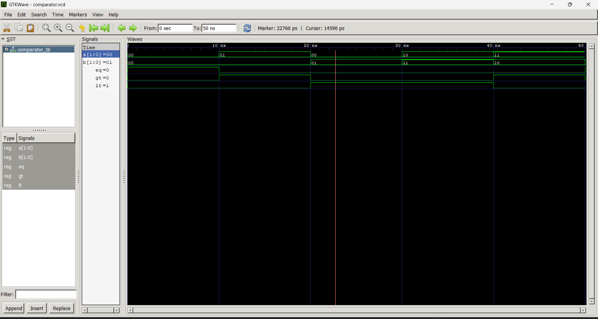

# Lab 5: 2-bit Magnitude Comparator

## Objective
* To design and simulate a 2-bit magnitude comparator in VHDL.
* To understand how comparison operations are implemented in hardware.

## Theory
A **magnitude comparator** compares two binary numbers and produces three output signals:

* **EQ** (*Equal*): HIGH when $A = B$
* **GT** (*Greater Than*): HIGH when $A > B$
* **LT** (*Less Than*): HIGH when $A < B$

For a 2-bit comparator with inputs $A = A_1A_0$ and $B = B_1B_0$:

$$
\text{EQ} = \overline{A_1 \oplus B_1} \cdot \overline{A_0 \oplus B_0}
$$

$$
\text{GT} = A_1\overline{B_1} + \overline{A_1 \oplus B_1} \cdot A_0\overline{B_0}
$$

$$
\text{LT} = \overline{A_1}B_1 + \overline{A_1 \oplus B_1} \cdot \overline{A_0}B_0
$$

## Output ##

## Discussion and Conclusion
  The 2-bit magnitude comparator was designed and simulated in VHDL. The outputs (EQ, GT, and LT) correctly indicated whether A was equal to, greater than, or less than B. The simulation results matched the expected behavior.
  The 2-bit magnitude comparator was successfully implemented and verified. The experiment demonstrated how binary numbers can be compared using digital logic in VHDL.