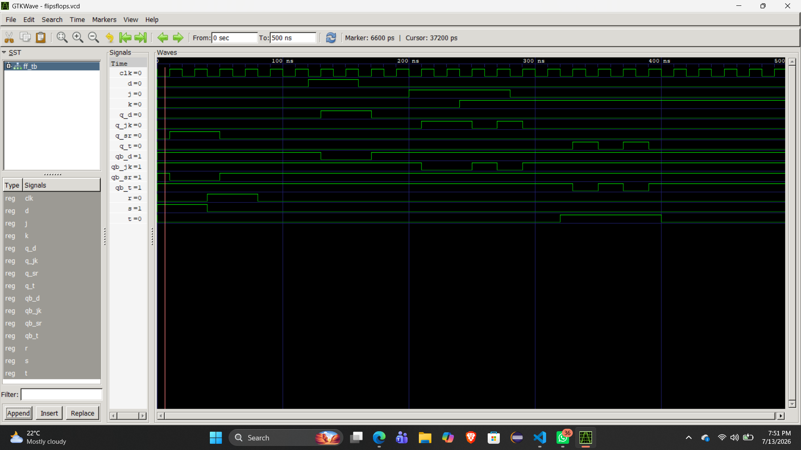

# Lab 7: VHDL Code for Sequential Circuits (Flip-Flops)

## Objective
* Design and simulate SR, D, JK, and T flip-flops in VHDL.
* Understand clock edge triggering in sequential logic circuits.

## Theory
Flip-flops are bistable memory elements storing one bit of data. Unlike combinational circuits, their outputs depend on current inputs and the previous state, synchronized to a clock edge.

--- 

* **SR:** Forms the structural basis but suffers from an invalid state when $S=1, R=1$.
* **D:** Eliminates ambiguity by sampling a single data line, making it perfect for CPU registers.
* **JK:** Resolves the SR invalid state by adding cross-coupled feedback to toggle safely.
* **T:** Efficiently isolates the toggle feature, serving as the core building block for binary counters and clock dividers.

## Truth Tables

### 1. SR Flip-Flop
| S | R | Q(next) | State |
|---|---|---|---|
| 0 | 0 | Q | Hold |
| 0 | 1 | 0 | Reset |
| 1 | 0 | 1 | Set |
| 1 | 1 | X | Forbidden |

### 2. D Flip-Flop
| D | Q(next) | State |
|---|---|---|
| 0 | 0 | Reset |
| 1 | 1 | Set |

### 3. JK Flip-Flop
| J | K | Q(next) | State |
|---|---|---|---|
| 0 | 0 | Q | Hold |
| 0 | 1 | 0 | Reset |
| 1 | 0 | 1 | Set |
| 1 | 1 | not Q | Toggle |

### 4. T Flip-Flop
| T | Q(next) | State |
|---|---|---|
| 0 | Q | Hold |
| 1 | not Q | Toggle |

---

## Output

---
## Discussion

* **Clock Synchronization:** All circuits use the `rising_edge(CLK)` condition to update the internal state signal `Q_int`, providing reliable and stable state transitions.
* **State Management:** The internal state signal is used as feedback to maintain the current state in toggle-based flip-flops (JK and T) and to generate the complementary output using `QB <= not Q_int`.

## Conclusion

We successfully implemented, compiled, and simulated all four fundamental flip-flops using behavioral VHDL modeling. The simulation results confirmed that edge-triggered sequential circuits accurately update and maintain their memory states only at the rising edge of the clock, ensuring stable and reliable operation.